# actiongate

[](LICENSE)
[](go.mod)
[](https://github.com/muhammadusamahoyrr/actiongate/releases/latest)

**An action firewall for AI coding agents.** Claude Code, Cursor, and other
agents can run shell commands, delete files, and touch production. actiongate
sits between the agent and the real world: harmless actions pass instantly,
forbidden actions are blocked with a named reason, and dangerous actions
pause until a human taps **Approve** in Slack. Everything that happens is
written to a tamper-evident audit log that anyone can verify independently.



```
 AI agent ──► gateway (your machine) ──► control plane (policy + approvals)
                  │                            │
                  │  signed, single-use grant  │──► Slack: [Approve] [Deny]
                  ▼                            ▼
             tool executes locally        hash-chained audit log
             (credentials never leave     (independently verifiable
              your machine)                with the `verify` tool)
```

Three properties make it different:

- **Works with closed agents.** No SDK, no code changes — it intercepts at
  the MCP tool boundary, the only place agents like Claude Code can be
  governed at all.
- **Your credentials stay home.** Decisions are central; execution and every
  secret stay on your machine. Approved actions run only under a signed,
  single-use, 60-second cryptographic grant that the gateway verifies locally.
- **The log can't be quietly rewritten.** Audit events are hash-chained and
  sealed with a signing key the application doesn't hold. `verify` re-derives
  every hash and signature from raw data — you check the math, not our word.

---

## Quickstart (60 seconds)

**Prerequisites:** Docker (it manages Postgres for you — or point
`actiongate up -db-url` at any PostgreSQL 16+).

Get the binaries from the
[latest release](https://github.com/muhammadusamahoyrr/actiongate/releases/latest)
or build from source (Go 1.25+): `go build -o bin/ ./cmd/...`

```bash
# 1. Start everything — Postgres, migrations, a tenant with the claude-code
#    starter policy, gateway enrollment, control plane. Leave it running.
actiongate up

# 2. In the project you want governed (new terminal):
actiongate protect claude-code

# 3. Start Claude Code in that project and ask it to read your .env:
#    🛑 blocked, with the rule named. Ask for `rm -rf` — it pauses for
#    human approval. Everything is in the sealed audit log.
```

`actiongate up` is idempotent — re-run it any time (e.g. after a reboot) and
it restarts whatever is missing. While it is down, protected projects fail
closed: governed tools are blocked, never silently allowed.

Want more than the quickstart? The **[User Guide](docs/GUIDE.md)** covers
every step in depth — concepts, custom policies, approvals, audit
verification, unattended operation, and troubleshooting.

### Survive reboots (Windows service)

One elevated command makes protection unattended:

```powershell
actiongate service install    # from an elevated terminal, once
```

The control plane then starts automatically after every reboot (delayed
start), restarts itself on failure, waits patiently for Docker/Postgres to
come up, and logs to `%APPDATA%\actiongate\service.log`. Check it any time
with `actiongate service status` (no elevation needed). `actiongate
service uninstall` removes it. Linux/macOS: run `controlplane` under
systemd/launchd with the `AG_*` environment for now.

### Starter policy packs

Pick one at protect time — users shouldn't have to write CEL for tool
schemas they've never seen:

| Pack | Behavior |
|---|---|
| `claude-code` (default) | Secrets denied; destructive shell (`rm -rf`, force-push, `DROP TABLE`, …) waits for approval; everything else passes |
| `paranoid` | Secrets denied; **every** shell command and file mutation waits for approval; reads pass |
| `relaxed` | Secrets denied; only catastrophic commands (`rm -rf /`, `dd`, `mkfs`, `DROP DATABASE`, …) wait |

```bash
actiongate protect claude-code -pack paranoid
```

### See the tamper-evidence for yourself

```bash
actiongate tamper-demo
```

It seals real events on a throwaway database, verifies them (`ok:true`),
then plays a malicious DBA: disables the append-only trigger and rewrites
an approval. The database accepts the edit — and re-verification flips to
`ok:false`, naming the exact tampered event. Your real chain is never
touched.

---

## Manual setup (15 minutes)

The step-by-step path — what `actiongate up` automates, useful for
understanding the pieces or wiring a non-local deployment.

**Prerequisites:** Go 1.25+, Docker (or any PostgreSQL 16+), and the
[goose](https://github.com/pressly/goose) migration tool
(`go install github.com/pressly/goose/v3/cmd/goose@latest`).

### 1. Get the binaries (2 min)

**No Go needed:** download the archive for your platform (Windows, macOS,
Linux) from the
[latest release](https://github.com/muhammadusamahoyrr/actiongate/releases/latest)
and extract it — it contains `actiongate`, `gateway`, `ag-hook`,
`controlplane`, `verify`, and the database `migrations/` folder used in
step 2.

Or build from source (Go 1.25+):

```bash
git clone https://github.com/muhammadusamahoyrr/actiongate
cd actiongate
go build -o bin/ ./cmd/...
```

### 2. Start Postgres and migrate (2 min)

```bash
docker run -d --name actiongate-db \
  -e POSTGRES_USER=ag -e POSTGRES_PASSWORD=ag -e POSTGRES_DB=actiongate \
  -p 5432:5432 postgres:16-alpine

goose -dir migrations postgres "postgres://ag:ag@localhost:5432/actiongate?sslmode=disable" up
```

### 3. Start the control plane (1 min)

```bash
export AG_DATABASE_URL="postgres://ag:ag@localhost:5432/actiongate?sslmode=disable"
export AG_TOKEN_SECRET="change-me-to-32-plus-random-bytes!!"
./bin/controlplane
```

It listens on `:8091`. On first start it prints generated signing-key seeds —
save them as `AG_GRANT_KEY_SEED` and `AG_EPOCH_KEY_SEED` so keys survive
restarts.

### 4. Create a tenant with a policy (2 min)

Save as `policy.json` — plain English version: *allow everything, deny
reading secrets files, require human approval for destructive shell commands:*

```json
{
  "default_decision": "allow",
  "rules": [
    {
      "id": "deny-secrets",
      "condition": "tool_name == \"read_file\" && params.path.contains(\".env\")",
      "decision": "deny",
      "risk_classification": "secrets"
    },
    {
      "id": "approve-destructive",
      "condition": "tool_name == \"bash\" && params.command.contains(\"rm -rf\")",
      "decision": "requires_approval",
      "risk_classification": "destructive"
    }
  ]
}
```

Conditions are [CEL](https://cel.dev) expressions over `tool_name`,
`agent_id`, `environment`, and `params`. Policies are compiled before they
are stored — a broken rule is rejected at provisioning, never at runtime.

```bash
export AG_DATABASE_URL="postgres://ag:ag@localhost:5432/actiongate?sslmode=disable"
TENANT=$(./bin/controlplane admin create-tenant -policy policy.json)
TOKEN=$(./bin/controlplane admin enroll-token -tenant $TENANT)
```

### 5. Enroll your gateway (1 min)

```bash
./bin/gateway enroll -server http://localhost:8091 -token $TOKEN -name my-laptop
```

This generates a keypair on your machine (the private key never leaves it),
exchanges the single-use token for a credential, and pins the control
plane's signing keys.

### 6. Try it (2 min)

An allowed action — returns a verified grant, exit code 0:

```bash
./bin/gateway check -agent me -session $(uuidgen) -request-id r1 \
  -tool bash -params '{"command":"ls"}'
./bin/gateway report -action <ACTION_ID_FROM_ABOVE> -status success
```

A denied action — exit code 2, and it tells you exactly which rule fired:

```bash
./bin/gateway check -agent me -session $(uuidgen) -request-id r2 \
  -tool read_file -params '{"path":"/app/.env"}'
# denied: denied by rule deny-secrets
```

A gated action — this call **blocks and waits for a human**:

```bash
./bin/gateway check -agent me -session $(uuidgen) -request-id r3 \
  -tool bash -params '{"command":"rm -rf /tmp/x"}' -wait 10m
```

With Slack configured (next section) an Approve/Deny message appears in your
channel. Without Slack, approve it from a second terminal:

```bash
TOKEN=$(docker exec actiongate-db psql -U ag -d actiongate -tAc \
  "select args->>'callback_token' from river_job where kind='deliver_approval' order by id desc limit 1")
curl -X POST http://localhost:8091/approval/callback \
  -H "Content-Type: application/json" \
  -d "{\"token\":\"$TOKEN\",\"decision\":\"approved\",\"approver_id\":\"you\",\"reason\":\"ok\"}"
```

The blocked `check` immediately returns with its grant, exit 0.

### 7. Wrap a real agent (2 min)

**MCP agents (Claude Code, Cursor, anything MCP):** change one line of the
agent's MCP config so the server command runs through the gateway:

```json
{ "mcpServers": { "mytools": {
    "command": "gateway",
    "args": ["mcp", "--", "node", "my-mcp-server.js"]
} } }
```

Every tool call now routes through your policy. Denied calls come back to
the agent as an explained error; gated calls pause inside the agent's tool
call until someone approves.

**Claude Code:** `actiongate protect claude-code` does this for you — it
installs the `ag-hook` PreToolUse bridge (Claude Code's built-in
Read/Write/Bash tools never cross the MCP boundary, so the hook is the
enforcement point that actually governs them), a SessionStart hook that
warns loudly when the control plane is down (governed tools fail closed,
never silently), and applies your chosen policy pack. A Claude Code
plugin with `/actiongate:protect`, `/actiongate:status`, and
`/actiongate:tamper-demo` commands lives in
[claude-plugin/](claude-plugin/).

**Other agent hooks:** `gateway check` exits `0` allowed / `2` denied /
`3` timeout, and `gateway report` sends the outcome — the exact contract
PreToolUse/PostToolUse-style hooks need.

### 8. Verify the audit trail (1 min)

Everything above was recorded, hash-chained, and sealed. Check it yourself:

```bash
./bin/verify -database-url "$AG_DATABASE_URL" -tenant $TENANT \
  -key epoch-1=<EPOCH_PUBLIC_KEY_BASE64>
# {"ok":true,"epochs":4,"events_sealed":15,"unsealed_tail":0,"problems":null}
```

`verify` trusts nothing but the public key: it re-derives every event hash,
epoch root, and signature from the raw rows. If anyone — including a
database admin — edited history, `ok` becomes `false` and the exact
tampered event is named.

---

## Slack approvals

Create a Slack app with a bot token (`chat:write`) and interactivity pointed
at `https://<your-host>/slack/interaction`, then:

```bash
export AG_SLACK_BOT_TOKEN="xoxb-..."
export AG_SLACK_SIGNING_SECRET="..."
export AG_SLACK_CHANNEL="C0123456789"
```

Approval requests become messages with Approve/Deny buttons; clicks are
signature-verified and recorded with the Slack user's identity.

## Configuration reference

| Env var | Required | Purpose |
|---|---|---|
| `AG_DATABASE_URL` | yes | Postgres connection string |
| `AG_TOKEN_SECRET` | yes (≥32 bytes) | HMAC secret for approval callback tokens |
| `AG_LISTEN` | no (`:8091`) | Control plane listen address |
| `AG_GRANT_KEY_SEED` / `AG_EPOCH_KEY_SEED` | recommended | Base64 32-byte signing seeds (ephemeral + warning if unset) |
| `AG_APPROVER_DEFAULT` | no (`team-lead`) | Default approver target |
| `AG_SLACK_BOT_TOKEN` / `AG_SLACK_SIGNING_SECRET` / `AG_SLACK_CHANNEL` | no | Slack approvals (for the Windows service, set `slack_bot_token` / `slack_signing_secret` / `slack_channel` in `%APPDATA%\actiongate\dev.json` instead — services don't see your shell env) |

Windows note: PowerShell 5.1 mangles JSON arguments containing spaces; run
`gateway check` from Git Bash, or avoid spaces in inline `-params`.

## How it works, in one paragraph

The gateway submits each tool call to the control plane, which evaluates it
against an ordered list of CEL rules (first match wins) and either issues a
signed **ExecutionGrant**, denies with the matched rule, or parks the action
pending approval. Approvals are single-use HMAC tokens resolved with
compare-and-swap — two approvers can't double-resolve, replays are rejected.
The gateway verifies each grant locally (signature against pinned keys,
content hash against the exact request, expiry) before executing, then
reports a signed outcome receipt. Every step appends to a per-tenant audit
stream that a background sealer numbers, hash-chains, and seals into signed
epochs. If an outcome never arrives, the action is honestly marked
`OutcomeUnknown` — never guessed.

## Development

```
make test      # full suite: real Postgres via Testcontainers, -race
make lint      # buf lint + breaking-change check
make proto     # regenerate ConnectRPC/protobuf code (then: make tidy)
make migrate   # goose migrations against $DATABASE_URL
```

Layout: `cmd/` (five binaries: `actiongate`, `controlplane`, `gateway`,
`ag-hook`, `verify`) · `internal/` (transition primitive, policy
engine, approvals, grants, queue workers, sealer, MCP proxy) ·
`migrations/` · `proto/` (the wire contract — breaking changes are blocked
in CI).

## Documentation

| Document | What it covers |
|---|---|
| [User Guide](docs/GUIDE.md) | Complete guide: concepts, installation, policies, approvals, verification, operations, troubleshooting |
| [docs/plan.md](docs/plan.md) | The architecture design record, frozen after 8 review rounds |
| [docs/tech-stack.md](docs/tech-stack.md) | Technology selection and the rationale behind it |
| [VERIFICATION.md](VERIFICATION.md) | Verification log — what was actually tested and observed, milestone by milestone |
| [claude-plugin/](claude-plugin/) | Claude Code plugin with `/actiongate:protect`, `/actiongate:status`, `/actiongate:tamper-demo` |

## License

Apache-2.0 — see [LICENSE](LICENSE).
